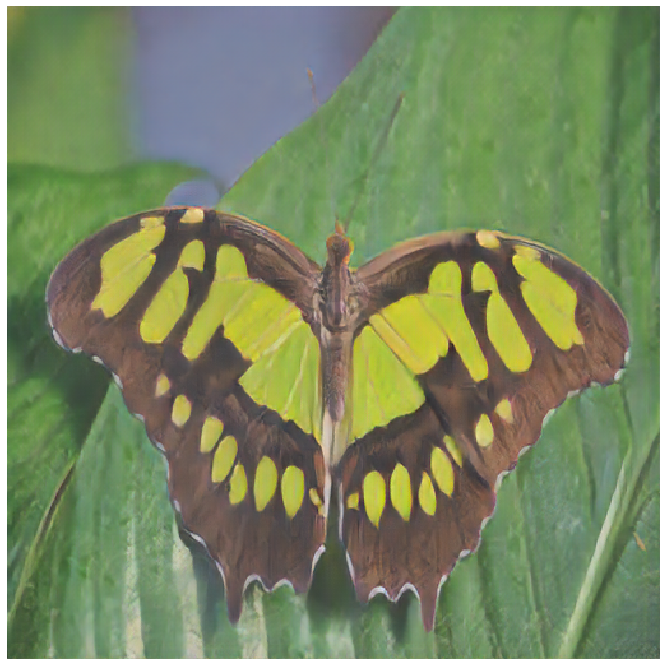
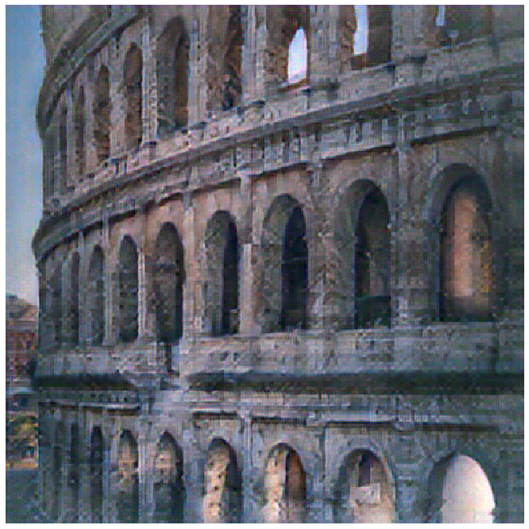
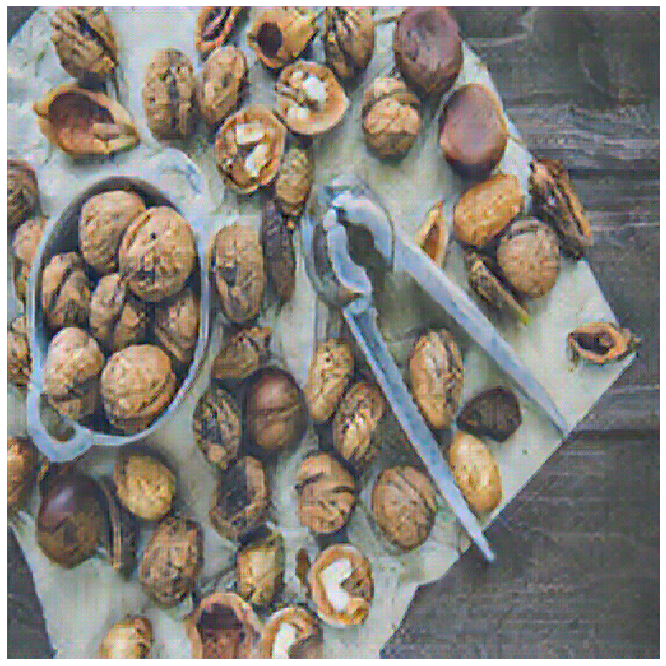

# Image-Enhancer-via-ESRGAN
The utilities developed in this tool are based off of the ESRGAN Paper: https://arxiv.org/abs/1809.00219

This tool enhances image resolution quality using deep convolutional neural networks. The idea is to train two neural networks to work against each other (the fundamental principle of Generative Adversarial Networks or GAN for short). A Generator is first trained a specified number iterations over the ground truth pixel loss using Mean Absolute Error or L1Loss. After the period of pixel loss is finished, the GAN is also tested on content loss (perceptual similarity) as well as the minimax GAN loss. The Discriminator is also introduced being trained on GAN loss. 

Specific weight files are too large thus I will include a set of instructions to generate your own enhancer.

Python Files
  -- models.py
    -- Contains the model architectures described in the ESRGAN paper including the Dense Blocks, Residual to Residual Dense Blocks, Generator, Discriminator, and VGG19 feature extractor (pre-trained model).
    
  -- train.py
    -- This file is an executable script which trains the GAN model and saves the generator, discriminator, and their respective optimizers to a specified directory every epoch. It also saves sample images of the generator's performance every epoch to a specified directory. Run this file as follows:
    ```
    python train.py --hyperparameters
    ```
    --hyperparameters are a list of hyperparameters to call in order to properly execute train.py. Each hyperparamter is to be entered in this format:
    ```
    --image_directory data/images/
    ```
    followed by a space to seperate each hyperparameter entered. Please refer to run_script.ipynb Jupyter Notebook file to see specific hyperparamters
    
  -- enhance.py
    -- An exectutable python script which takes in directory to a low resolution image file, image transformation length, directory to ideal generator, and directory to which the enhanced image will be saved. This script passes the Tensor form of specified image through the generator to create an enhanced version of the image and saves it to specified directory. Below is a example of how to run the file:
    ```
    python enhance.py --image_file test_image.png --file_length 128 --dir_to_generator best_generator_model.pt --save_directory data
    ```
    In the above command, **test_image.png**, **128**, **best_generator_model.pt**, and **data** are the parameters I passed. These may vary depending on the user's choice
    
Back to the functionality of this respository, lets take a look at some examples of enhanced images!

## Sample Low Resolution Images


## GAN Enhanced Super Resolution Samples


## One-to-One Comparions (Low Res --> Enhanced)

### 150 Epochs Trained
 

### 50 Epochs Trained
 

### 25 Epochs Trained
 
